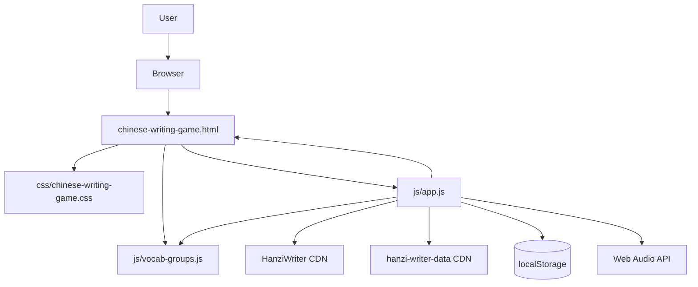
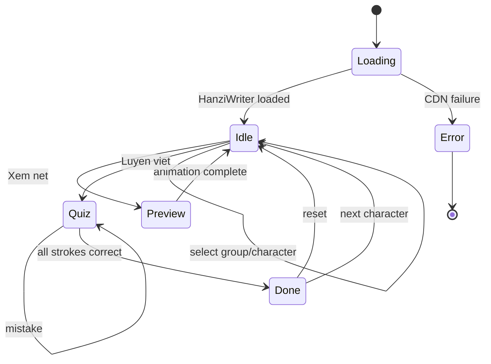
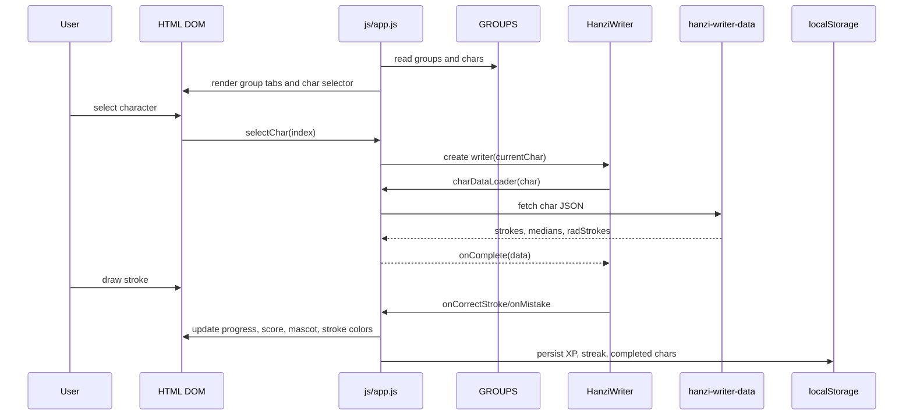

# CODEMAP - Chinese Writing Game

Updated: 2026-05-21

Scope: product code only. SDD, Claude/Codex adapter files, harness scripts, and internal operating docs are intentionally excluded from this map.

## System Summary

Single-page browser game for Vietnamese learners practicing Chinese character stroke order. No backend, no build step, no package manager. Runtime is static HTML/CSS/JavaScript plus CDN-loaded HanziWriter and HanziWriter stroke data.

Current vocabulary coverage: 189 active characters across 10 HSK1 topic groups. The active set covers all 178 unique Han characters extracted from the HSK1 classic 150-word source list, plus 11 legacy extra characters kept from the earlier themed dataset.

## Runtime Entry

| File | Role | Notes |
| --- | --- | --- |
| `chinese-writing-game.html` | App shell and DOM contract | Loads stylesheet, data file, and game logic. Defines header stats, group tabs, character selector, Hanzi canvas, mascot bubble, progress UI, controls, and help modal. |
| `css/chinese-writing-game.css` | Full visual system | Contains layout, responsive rules, buttons, canvas frame, progress bars, modal, mascot, confetti canvas, and mobile constraints. |
| `js/vocab-groups.js` | Static writing content | Defines `GROUPS` character data and `STROKE_COLORS`. Must load before `js/app.js`. |
| `js/app.js` | Game controller | Owns state, HanziWriter loading, navigation, quiz/preview modes, scoring, XP/streak persistence, audio, confetti, and SVG stroke coloring. |

## Data Model

`js/vocab-groups.js` exposes:

| Symbol | Shape | Purpose |
| --- | --- | --- |
| `GROUPS` | `Array<{ id, label, icon, chars }>` | Character groups shown as tabs. Current data has 10 topic groups: numbers, pronouns/particles, people/family, time, places/directions, food/drink, objects/transport, verbs/actions, adjectives/states, and nature/legacy. |
| `chars[]` | `{ char, pinyin, meaning, strokes }` | Character metadata used by selector, display panel, progress dots, and HanziWriter setup. |
| `STROKE_COLORS` | `string[]` | Cycled color palette for correctly drawn strokes and stroke dots. |

Data flow:

```text
GROUPS -> buildGroupTabs()
GROUPS[current] -> buildCharSelector()
currentChar -> initWriter() -> HanziWriter charDataLoader -> CDN stroke JSON
quiz events -> progress UI + score UI + localStorage + mascot + SFX
```

## Architecture Diagram



## Workflow Diagram



## Data Flow Diagram



## Main Game State

| State | Owner | Meaning |
| --- | --- | --- |
| `currentGroup`, `currentChar` | `js/app.js` | Active vocabulary group and character. |
| `writer` | `js/app.js` | Current HanziWriter instance bound to `#hanzi-container`. |
| `mode` | `js/app.js` | `idle`, `preview`, `quiz`, or `done`; drives badge and button disabled state. |
| `strokeTotal`, `strokeDone` | `js/app.js` | Current character progress. |
| `scoreCorrect`, `scoreAttempts`, `scoreChars` | `js/app.js` | Session score counters. |
| `completedChars` | `js/app.js` + `localStorage` | Unique completed characters, persisted as `hz_completed_chars`. |
| `xp`, `level`, `streak`, `isMuted` | `js/app.js` + `localStorage` | Gamification state persisted with `hz_xp`, `hz_streak`, `hz_last_date`, `hz_muted`. |
| `strokeColorMap`, `strokeObserver` | `js/app.js` | Tracks and reapplies colored SVG strokes after HanziWriter DOM mutations. |
| `confettiCanvas`, `confettiParticles` | `js/app.js` | Completion animation state. |

## Core Flows

### Startup

```text
IIFE init()
  -> cache confetti canvas
  -> loadGamification()
  -> buildGroupTabs()
  -> buildCharSelector()
  -> build initial stroke dots
  -> loadHanziWriter()
  -> initWriter()
```

If all HanziWriter CDNs fail, status bubble shows error and `.btn` controls are disabled.

### Group And Character Navigation

```text
buildGroupTabs()
  -> selectGroup(idx)
    -> buildCharSelector()
    -> selectChar(0)

prevChar()/nextChar()
  -> selectChar(newIndex)
```

`selectChar()` clears stroke coloring, updates visible metadata, hides completion overlay, resets mode, rebuilds HanziWriter, and updates mascot.

### Preview Mode

```text
animateStrokes()
  -> setMode('preview')
  -> reset progress and dots
  -> writer.animateCharacter()
  -> onComplete: setMode('idle')
```

Navigation and selectors are locked while preview animation runs.

### Quiz Mode

```text
startQuiz()
  -> setMode('quiz')
  -> writer.quiz({
       onMistake,
       onCorrectStroke,
       onComplete
     })
```

`onMistake` increments attempts, plays wrong SFX, updates mascot/status.

`onCorrectStroke` increments correct/attempt counters, updates stroke progress, colors dot and SVG stroke, grants `+10 XP`, and advances drawing color.

`onComplete` disconnects observer, shows overlay, persists completed char, grants completion XP, updates streak, plays completion SFX, and triggers confetti.

### Reset

```text
resetChar()
  -> disconnect stroke observer
  -> clear strokeColorMap
  -> hide overlay
  -> setMode('idle')
  -> initWriter()
```

## DOM Contracts

`js/app.js` expects these important IDs from `chinese-writing-game.html`:

| Area | IDs |
| --- | --- |
| Header stats | `user-streak`, `user-xp`, `user-level`, `level-progress-fill`, `mute-toggle`, `btn-help` |
| Selection | `group-tabs`, `char-selector` |
| Character info | `char-display`, `char-pinyin`, `char-meaning`, `stroke-count-badge` |
| Writing surface | `hanzi-container`, `confetti-canvas`, `complete-overlay`, `complete-sub` |
| Controls | `btn-prev`, `btn-next`, `btn-animate`, `btn-quiz`, `btn-reset` |
| Feedback | `mode-badge`, `stroke-hint`, `progress-fill`, `progress-text`, `mascot-bubble`, `mascot-text` |
| Scores | `score-correct`, `score-attempts`, `score-chars` |
| Help modal | `help-modal` |

Inline `onclick` attributes call global functions from `js/app.js`, so function names are part of the HTML contract.

## External Dependencies

| Dependency | Loaded From | Used By | Fallback |
| --- | --- | --- | --- |
| Google Fonts | `fonts.googleapis.com` | `chinese-writing-game.html` | Browser default fonts if unavailable. |
| HanziWriter | jsDelivr, unpkg | `loadHanziWriter()` | Multiple CDN URLs; failure disables game controls. |
| HanziWriter data | jsDelivr, unpkg | `charDataLoader` in `initWriter()` | Multiple CDN URLs per character; failure shows status error. |
| Web Audio API | Browser | `initAudio()`, `playSFX()` | Errors caught and logged; game continues. |
| localStorage | Browser | `loadGamification()`, XP/streak/completion/mute persistence | Missing/corrupt completed-char JSON falls back to empty set. |

## Styling Structure

| CSS Area | Main Selectors |
| --- | --- |
| Design tokens | `:root` variables |
| Page shell | `html`, `body`, `.header`, `.container` |
| Selection UI | `.group-tabs`, `.group-tab`, `.char-selector`, `.char-btn` |
| Main card | `.main-card`, `.char-info`, `.canvas-area-container`, `.canvas-wrapper` |
| Controls | `.btn`, `.btn-side-animate`, `.btn-side-quiz`, `.btn-floating-nav`, `.btn-complete-next` |
| Feedback | `.mode-badge`, `.stroke-hint`, `.stroke-dot`, `.progress-*`, `.mascot-*` |
| Effects | `#confetti-canvas`, `.complete-overlay`, `@keyframes` blocks |
| Modal | `.modal-backdrop`, `.modal-card`, `.help-step` |
| Responsive | `@media (max-width: 480px)` |

Note: stylesheet contains earlier base rules followed by later overriding design-system rules. Later rules win through cascade order.

## Product Docs And Assets

| File | Role |
| --- | --- |
| `README.md` | User-facing overview, current feature list, file structure, local run note. |
| `PRD.md` | Product requirements and backlog history; some counts are older than current `GROUPS` data. |
| `design/specs/vocab-groups.md` | Original grouped-vocabulary spec; older 4-group scope, now superseded by 7-group implementation. |
| `docs/vocabulary/hsk1-classic-150.md` | Source note and normalized HSK1 classic 150-word list used for current coverage. |
| `docs/technical/VOCABULARY_WORKFLOW.md` | Process for source selection, word-to-character extraction, CDN verification, and future word-mode migration. |
| `CHANGELOG.md` | Release notes through current UI/game changes. |
| `TODO.md` | Lightweight backlog placeholder. |
| `banner.png`, `poster.png` | Visual assets for repo/product presentation. |
| `css_diff.txt` | CSS comparison artifact, not runtime code. |

## Deployment

| File | Role |
| --- | --- |
| `vercel.json` | Rewrites `/` to `/chinese-writing-game.html` for static Vercel hosting. |

No server routes, API endpoints, database schema, migrations, package scripts, or build pipeline exist for product runtime.

## Change Hotspots

| Goal | Start Here | Watch |
| --- | --- | --- |
| Add vocabulary | `js/vocab-groups.js` | Keep `strokes` accurate for HanziWriter progress dots and completion text. |
| Change game scoring | `startQuiz()`, `addXP()`, `handleStreakAndCompletion()` in `js/app.js` | Score counters are mixed session state plus persisted gamification state. |
| Change writing UX | `initWriter()`, `animateStrokes()`, `startQuiz()`, `resetChar()` | Button locks depend on `mode` and `updateControlsState()`. |
| Change stroke coloring | `STROKE_COLORS`, `colorStrokeSVG()`, `applyAllStrokeColors()` | SVG traversal depends on HanziWriter DOM structure. |
| Change responsive layout | `css/chinese-writing-game.css` and IDs/classes in HTML | Canvas size also comes from `getWriterSize()` and `resizeHanziWriter()`. |
| Change persistence | `loadGamification()`, `addXP()`, `handleStreakAndCompletion()` | Existing localStorage keys use `hz_*`. |
| Change completion effects | `onComplete` inside `startQuiz()`, `triggerConfetti()`, `.complete-overlay` CSS | Confetti canvas dimensions depend on parent `.canvas-wrapper`. |

## Known Drift

| Source | Drift |
| --- | --- |
| `PRD.md` | Describes v0.2 with 4 groups and 48 characters; implementation now has 10 groups and 189 active characters. |
| `design/specs/vocab-groups.md` | Original spec lists 4 groups; implementation has expanded to HSK1 source coverage. |
| `README.md` | Current file structure is accurate, but displayed encoding may depend on terminal/viewer settings. |

## Revision History

| Date | Author | Summary |
| --- | --- | --- |
| 2026-05-21 | Codex | Added HSK1 source coverage notes: 150 source words, 178 extracted HSK1 characters, 189 active characters. |
| 2026-05-21 | Codex | Created product-only code map; excluded SDD/runtime adapter files and harness scripts. |
